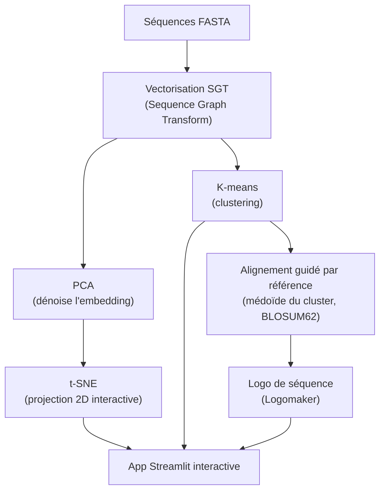

# sequence-classifier-app

[](https://www.docker.com/)
[](LICENSE)

**Application web de classification de séquences protéiques sans alignement préalable**

> Auteur : Romain KPAKOU | Master 2 Bioinformatique, Nantes Université
> GitHub : [github.com/romainkpakou](https://github.com/romainkpakou)

---

## Contexte et transparence sur les données

Ce dépôt reprend la méthodologie d'une application développée en stage (Affilogic,
Nantes) pour la classification de Nanofitines (ligands d'affinité) sans alignement
préalable. **Les séquences de Nanofitines sont la propriété d'Affilogic** et ne sont ni
publiées ni réutilisées ici. Cette application démontre la même méthode — vectorisation
sans alignement, réduction dimensionnelle, clustering, logos de séquence — sur un jeu de
séquences **publiques de globines** (hémoglobines et myoglobines, UniProt/Swiss-Prot),
choisi pour sa diversité fonctionnelle bien caractérisée.

Voir [PLAN.md](PLAN.md) pour le détail de la démarche.

---

## Méthode



**Sequence Graph Transform (SGT)** encode les motifs de proximité entre acides aminés
(courte et longue portée) directement depuis la séquence brute, sans nécessiter
d'alignement de référence — utile quand les séquences n'ont pas d'homologie structurale
évidente ou sont trop courtes/divergentes pour un alignement classique.

---

## Prérequis

| Outil | Installation |
|---|---|
| Docker | [docs.docker.com](https://docs.docker.com) |
| ou Python ≥ 3.11 | pour lancer sans conteneur |

---

## Utilisation

### Avec Docker (recommandé)

```bash
docker build -t sequence-classifier-app .
docker run --rm -p 8501:8501 sequence-classifier-app
```

Puis ouvrir [http://localhost:8501](http://localhost:8501).

### Sans Docker

```bash
python3 -m venv .venv && source .venv/bin/activate
pip install -r requirements.txt
streamlit run app.py
```

### Voir un résultat sans rien installer

L'application est interactive — pour un aperçu statique des résultats sans la lancer,
voir [`results/report.html`](https://htmlpreview.github.io/?https://github.com/romainkpakou/sequence-classifier-app/blob/main/results/report.html)
(projection t-SNE, table de clustering, logos de séquence sur le jeu d'exemple). Régénérable
via `python3 scripts/generate_report.py`.

L'application propose par défaut le jeu d'exemple (`data/example_sequences.fasta`, 100
séquences de globines), ou l'upload d'un FASTA personnalisé.

---

## Fonctionnalités

- Vectorisation SGT sans alignement (paramètre kappa ajustable)
- Réduction dimensionnelle PCA → t-SNE, projection interactive (Plotly)
- Clustering K-means (nombre de clusters ajustable)
- Logo de séquence par cluster (alignement guidé par référence + Logomaker)
- Export CSV des résultats

## Limites

- L'alignement utilisé pour les logos de séquence est une **approximation guidée par
  référence** (alignement pairwise contre la séquence médoïde du cluster), pas une MSA
  rigoureuse (MUSCLE/Clustal) — suffisant pour visualiser les positions conservées d'un
  cluster de séquences homologues, mais moins précis qu'une vraie alignement multiple.
- Le clustering K-means impose un nombre de clusters fixé a priori ; une méthode par
  densité (HDBSCAN) serait plus adaptée pour un jeu de séquences très hétérogène.

## Licence

MIT — voir [LICENSE](LICENSE).
